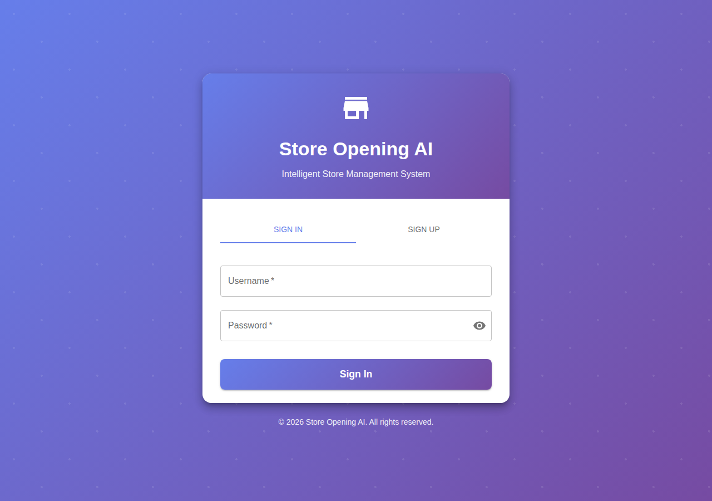
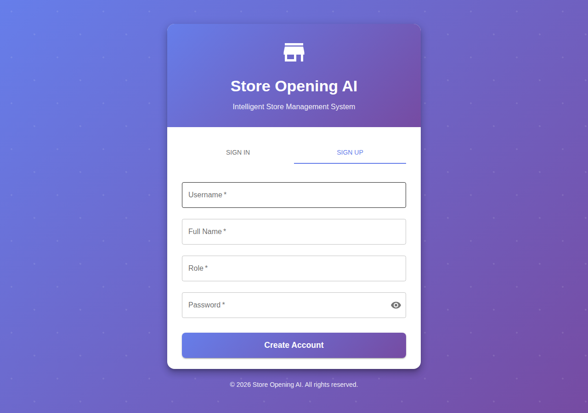
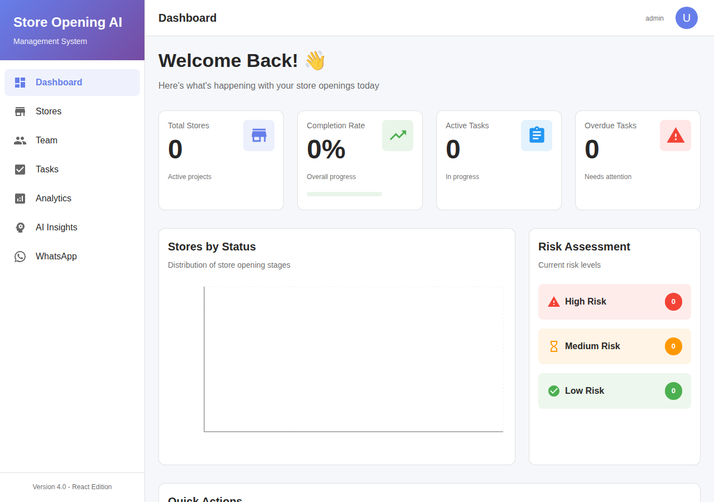
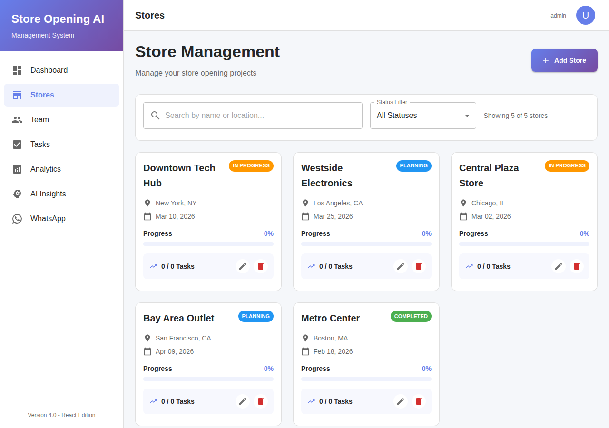
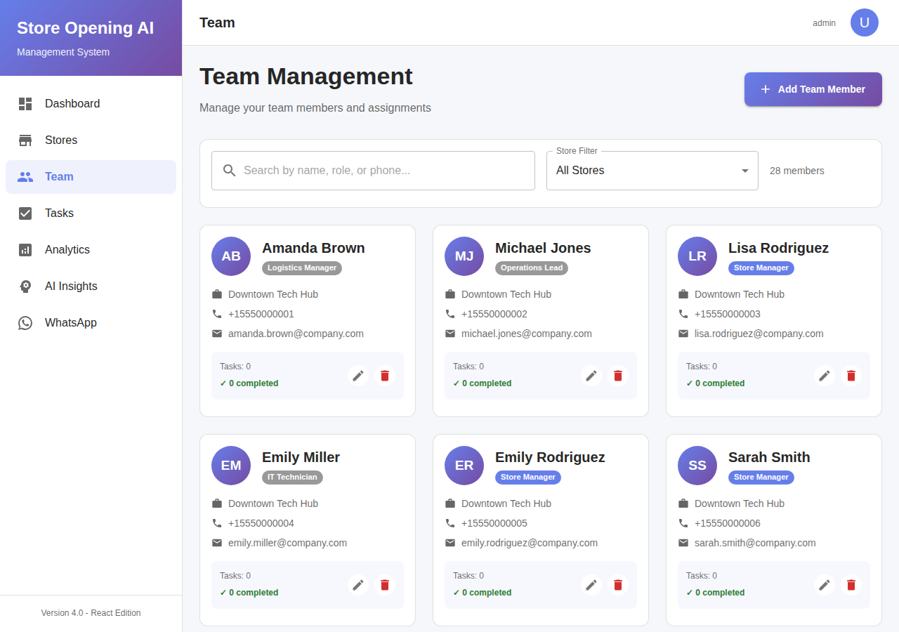
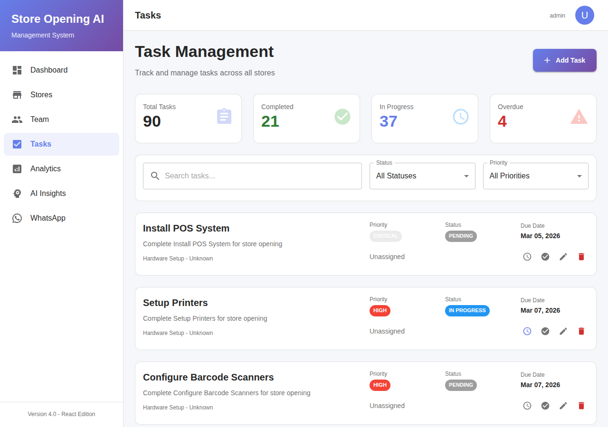
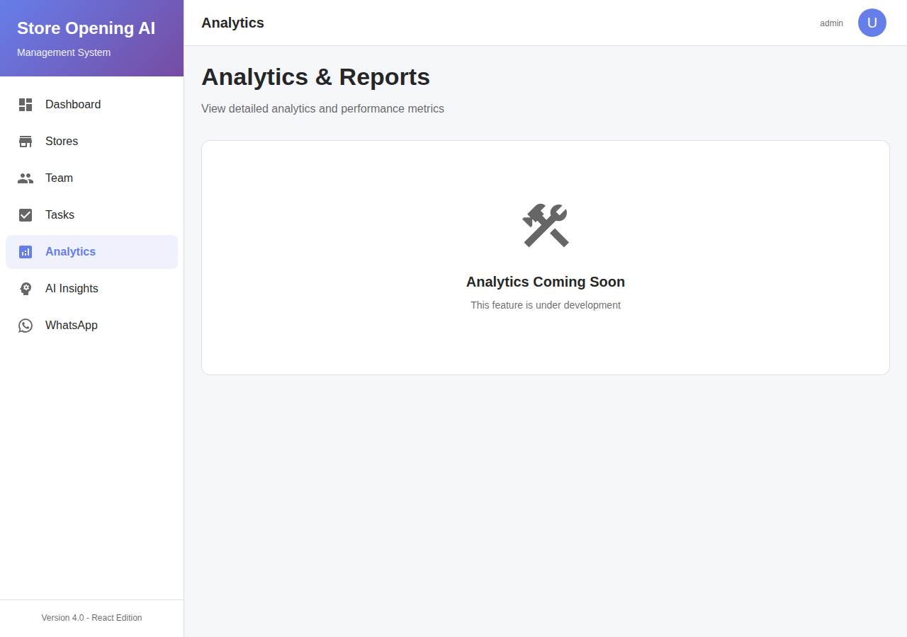
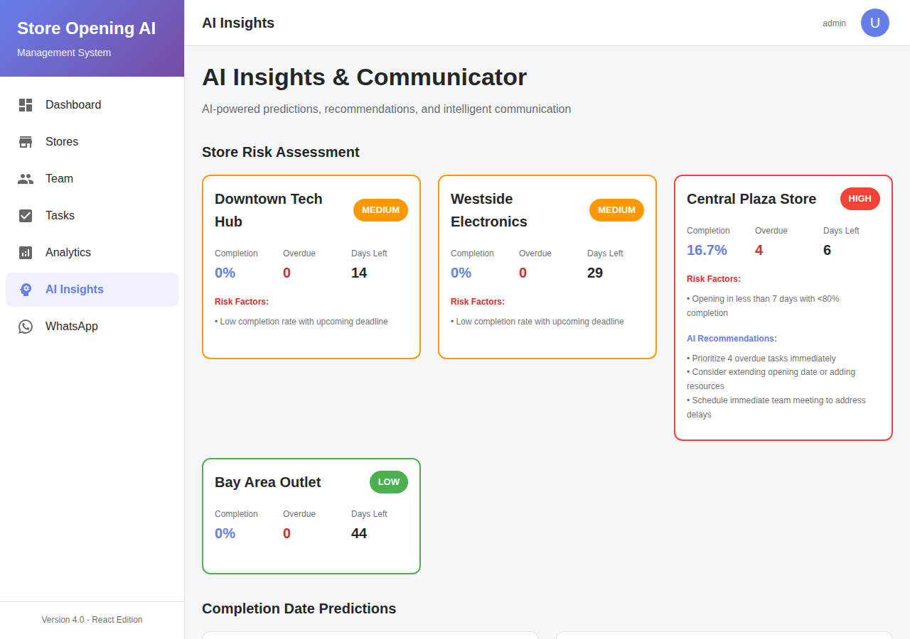
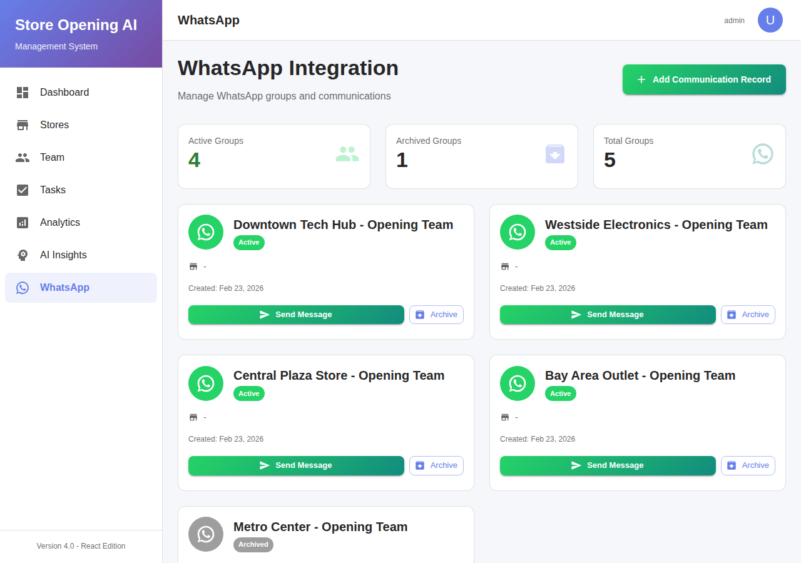

# 📸 Visual Screenshot Documentation

**Store Opening AI Management System** — complete visual walkthrough of the application interface.

---

## Table of Contents

1. [Login Page](#1-login-page)
2. [Sign Up Page](#2-sign-up-page)
3. [Dashboard Overview](#3-dashboard-overview)
4. [Stores Management](#4-stores-management)
5. [Team Members](#5-team-members)
6. [Tasks & Checklists](#6-tasks--checklists)
7. [Analytics](#7-analytics)
8. [AI Insights](#8-ai-insights)
9. [WhatsApp Groups](#9-whatsapp-groups)
10. [Application Flow Summary](#10-application-flow-summary)

---

## 1. Login Page

**URL:** `http://localhost:3000/login`

The entry point to the application. Users log in with their username and password. The interface features a modern purple gradient theme consistent throughout the app.



**Key elements:**
- 🏪 Store Opening AI branding with store icon
- 📝 **SIGN IN** / **SIGN UP** tab switcher
- 🔑 Username and Password fields
- 👁️ Password visibility toggle
- 🟣 **Sign In** button with gradient styling

**Default credentials for testing:**
| Role | Username | Password |
|------|----------|----------|
| Admin | `admin` | `admin123` |
| Manager | `manager` | `manager123` |
| Team Member | `user` | `user123` |

> ⚠️ **Security Notice:** These are default demo credentials for testing/development only. **Always change these passwords before deploying to production.** See [SECURITY.md](../SECURITY.md) for guidance.

---

## 2. Sign Up Page

**URL:** `http://localhost:3000/login` (Sign Up tab)

New users can create an account by switching to the **SIGN UP** tab on the same login page.



**Key elements:**
- 📝 Username field
- 👤 Full Name field
- 💼 Role field (e.g., Manager, Developer)
- 🔑 Password field
- ✅ **Create Account** button

---

## 3. Dashboard Overview

**URL:** `http://localhost:3000/`

The main dashboard provides a bird's-eye view of all store opening operations, metrics, and upcoming activities.



**Key elements:**
- 📊 **Summary metrics cards** — Total Stores, Active Stores, Completion Rate, Overdue Tasks
- 📈 **Bar chart** — Store progress visualization
- 🏪 **Store status list** — Quick overview of all stores with status badges
- 📅 **Upcoming openings** — Stores scheduled to open soon
- 🧭 **Left sidebar navigation** — Access to all application sections

**Sidebar navigation items:**
- Dashboard
- Stores
- Team
- Tasks
- Analytics
- AI Insights
- WhatsApp

---

## 4. Stores Management

**URL:** `http://localhost:3000/stores`

Manage all store opening projects. Create new stores, track their progress through the 7-stage workflow, and monitor their status.



**Key elements:**
- ➕ **Add Store** button to create a new store opening project
- 🗂️ **Store cards** — Each card shows store name, location, opening date, status badge
- 📊 **Progress indicators** — Visual completion percentage for each store
- 🔍 **Filter/search** functionality
- 🏷️ **Status badges:** `Planning`, `In Progress`, `Completed`

**7-Stage Workflow per store:**
1. Update Nearby Store Details
2. Complete Checklist & Send to Warehouse
3. Confirm Material at Nearby Store
4. Confirm Material at Actual Store
5. Start Installation & TeamViewer ID
6. Final Checklist
7. Store Opening Complete

---

## 5. Team Members

**URL:** `http://localhost:3000/team`

Manage team members assigned to store opening projects. View member details, roles, and store assignments.



**Key elements:**
- ➕ **Add Team Member** button
- 👥 **Member cards/list** — Name, role, assigned store, contact info
- 🔍 **Filter by store** — View team members per store
- 📊 **Team statistics** — Total members, members per store
- 📞 **Contact information** — Phone numbers and emails

---

## 6. Tasks & Checklists

**URL:** `http://localhost:3000/tasks`

Track all tasks and checklists across stores. Monitor completion status, due dates, and priority levels.



**Key elements:**
- 📋 **Checklist categories:**
  - Hardware Setup (POS, Printers, Scanners, Cameras, Network)
  - Software & Accounts (Employee accounts, Inventory, POS config)
  - Connectivity (Internet, SIM cards, WiFi, Payment gateway)
  - Training & Documentation (Staff training, Manuals, Security)
- ✅ **Task status** — Pending, In Progress, Completed
- ⚠️ **Priority badges** — High, Medium, Low
- 📅 **Due dates** — With overdue indicators
- 🏪 **Filter by store**

---

## 7. Analytics

**URL:** `http://localhost:3000/analytics`

Comprehensive analytics and reporting for store opening operations, including progress trends, task analysis, and performance metrics.



**Key elements:**
- 📊 **Charts & graphs** — Powered by Recharts
- 📈 **Completion trends** — Over time analysis
- 🏪 **Store progress comparison** — Side-by-side metrics
- 📋 **Task analysis** — Completion rates by category
- ⏰ **Timeline performance** — On-time vs. delayed stages
- 🎯 **KPI metrics** — Key performance indicators

---

## 8. AI Insights

**URL:** `http://localhost:3000/ai-insights`

AI-powered analytics and recommendations using machine learning models to predict risks, identify patterns, and provide actionable insights.



**Key elements:**
- 🤖 **Risk predictions** — ML-powered risk assessment (78%+ accuracy)
- 🏆 **Success patterns** — What factors lead to successful openings
- ⚠️ **Risk alerts** — High, Medium, Low risk classifications
- 📊 **Predictive analytics** — Forecast store completion likelihood
- 💡 **Recommendations** — AI-generated action items
- 🧠 **Self-learning models** — 4 ML models that improve over time

---

## 9. WhatsApp Groups

**URL:** `http://localhost:3000/whatsapp`

Manage WhatsApp communication groups for each store. Send messages, view conversation history, and manage archived chats.



**Key elements:**
- 💬 **Group list** — All WhatsApp groups per store
- ✉️ **Send message** — Direct message to group members
- 📁 **Archived conversations** — Historical chat records
- 🔔 **Message history** — Full audit trail of communications
- 📱 **Multi-channel notifications** — WhatsApp + SMS + Email + Voice

---

## 10. Application Flow Summary

The typical application workflow follows these steps:

```
┌─────────────────────────────────────────────────────────────┐
│                    APPLICATION FLOW                         │
├─────────────────────────────────────────────────────────────┤
│                                                             │
│  1. LOGIN ──────────────────────────────────────────────►  │
│     Enter credentials (admin/admin123)                      │
│            │                                                │
│            ▼                                                │
│  2. DASHBOARD ──────────────────────────────────────────►  │
│     View overview metrics & store status                    │
│            │                                                │
│            ▼                                                │
│  3. CREATE STORE ───────────────────────────────────────►  │
│     Add new store with opening date & location              │
│            │                                                │
│            ▼                                                │
│  4. ADD TEAM MEMBERS ───────────────────────────────────►  │
│     Assign team members to the store                        │
│            │                                                │
│            ▼                                                │
│  5. COMPLETE CHECKLISTS ────────────────────────────────►  │
│     Work through Hardware, Software, Connectivity,          │
│     and Training checklists                                 │
│            │                                                │
│            ▼                                                │
│  6. MONITOR WORKFLOW (7 Stages) ────────────────────────►  │
│     Stage 1: Nearby store details                           │
│     Stage 2: Checklist & warehouse shipment                 │
│     Stage 3: Material at nearby store                       │
│     Stage 4: Material at actual store                       │
│     Stage 5: Installation + TeamViewer ID                   │
│     Stage 6: Final checklist verification                   │
│     Stage 7: Store opening complete! ✅                     │
│            │                                                │
│            ▼                                                │
│  7. AUTOMATED NOTIFICATIONS ────────────────────────────►  │
│     WhatsApp groups updated automatically                   │
│     Email notifications sent to stakeholders                │
│     SMS/Voice escalations for overdue tasks                 │
│            │                                                │
│            ▼                                                │
│  8. ANALYTICS & AI INSIGHTS ────────────────────────────►  │
│     Review performance metrics                              │
│     AI risk predictions & recommendations                   │
│     ML models self-improve from historical data             │
│                                                             │
└─────────────────────────────────────────────────────────────┘
```

### Automation Highlights

| Feature | Description |
|---------|-------------|
| 🔄 Auto-escalations | 4-level escalation: WhatsApp → SMS → Voice → Email |
| ⏰ Schedulers | 4 background schedulers (hourly, 2h, 6h, daily) |
| 🤖 AI Messages | Context-aware, AI-generated follow-up messages |
| 📊 ML Models | 4 self-learning models with 78%+ prediction accuracy |
| 📅 Timeline Mgmt | Automatic deadline recalculation on date changes |
| 📦 Material Tracking | 4-checkpoint logistics: Warehouse → Store |

---

## Quick Start

1. **Start the backend:**
   ```bash
   python main.py
   ```

2. **Start the React frontend:**
   ```bash
   cd react-frontend && npm start
   ```

3. **Seed demo data:**
   ```bash
   python data/seed_beta_data.py
   ```

4. **Open browser:** Navigate to `http://localhost:3000`

5. **Login:** Use `admin` / `admin123`

> ⚠️ **Security Notice:** The default credentials above are for **testing and development only**. Change all default passwords before deploying to a production environment. See [SECURITY.md](../SECURITY.md) for more information.

---

*Screenshots captured from the live application running React.js frontend (v4.0) with Flask backend.*
